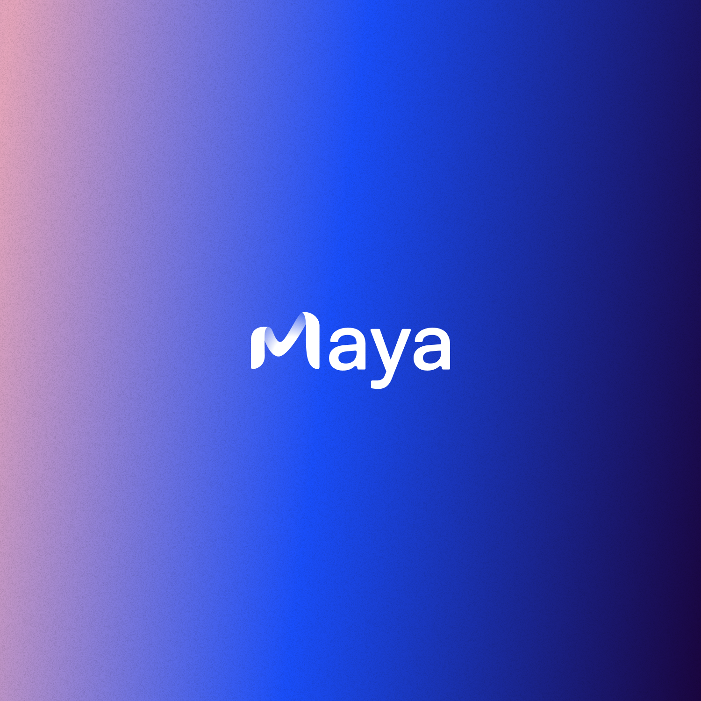

# Introduction

The [Maya CLI](https://github.com/0xmayalabs/maya-cli) is a 100% open source, contributor-friendly command line tool written in [go](https://go.dev/doc/install) to generate and verify zero-knowledge proof of image transformations.
